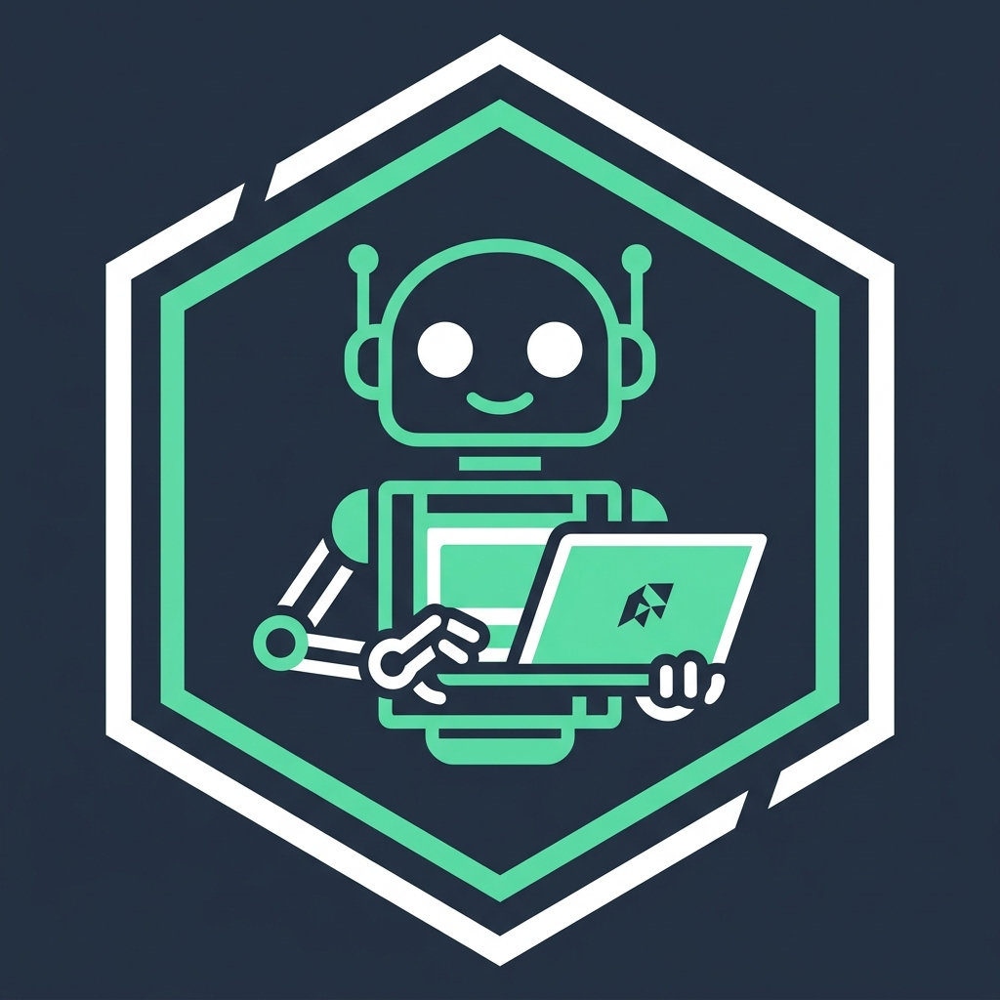
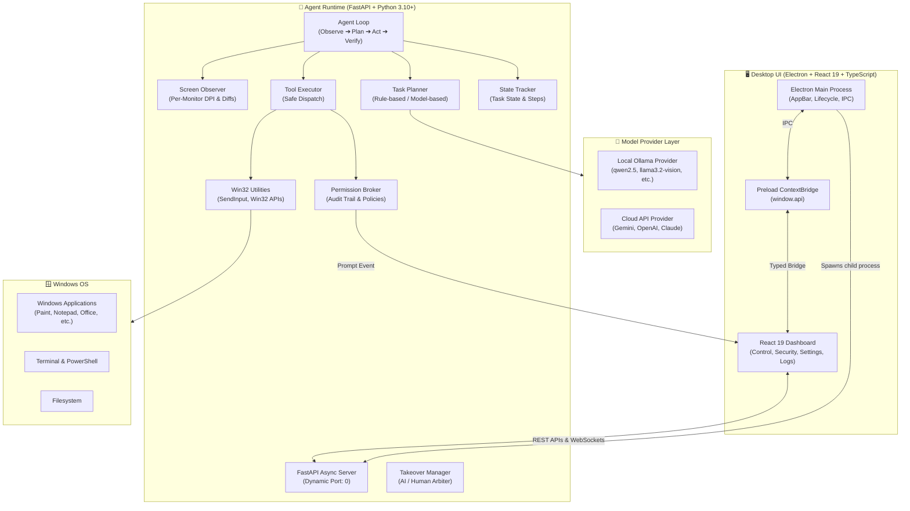

# 🤖 SPR SAATHI (साथी)

<div align="center">



### **Autonomous Desktop AI Computer Agent & Companion for Windows**

[-0078D6?logo=windows&logoColor=white)](https://microsoft.com/windows)
[](https://python.org)
[](https://electronjs.org)
[](https://react.dev)
[](https://typescriptlang.org)
[](https://fastapi.tiangolo.com)
[](https://ollama.com)
[](#license)

*Your intelligent companion ("Saathi") for desktop workflow automation, visual task execution, and conversational AI.*

---

[Key Highlights](#-key-highlights) •
[Dual Operating Modes](#-dual-operating-modes) •
[System Architecture](#-system-architecture) •
[Tool Ecosystem](#-tool-ecosystem--permission-scopes) •
[Getting Started](#-getting-started) •
[Configuration](#-configuration--models) •
[API & WebSockets](#-api--websocket-reference)

</div>

---

## 📖 Overview

**SPR SAATHI** (from Hindi *साथी* meaning *Companion* / *Partner*) is an advanced, production-grade desktop AI computer agent specifically engineered for **Windows 10 and 11**.

Operating side-by-side with your everyday workflow in an auto-docking right sidebar, SPR SAATHI combines hardware-level Win32 input simulation, visual perception, granular safety controls, and multi-model intelligence to automate complex tasks across your operating system—from interacting with desktop software, drawing in graphics applications, and managing files, to running terminal commands and browsing the web.

When autonomous execution is not required, SPR SAATHI instantly shifts into an interactive **Conversational Chatbot** with voice speech-to-text input, markdown code formatting, and context-aware responses.

---

## ✨ Key Highlights

- 🤖 **Autonomous Multi-Step Computer Agent**: Executes tasks through a disciplined `OBSERVE → PLAN → CHECK PERMISSION → ACT → VERIFY → REPLAN` loop.
- 💬 **Dual Operating Modes**: Switch effortlessly between full **Autonomous Agent Mode** (OS actions) and **Chatbot Mode** (conversational ChatGPT-style assistant).
- 🖥️ **Native Windows AppBar Docking**: Utilizes Windows `SHAppBarMessage` to dock as a fixed 25% sidebar while dynamically shrinking the desktop work area—meaning your open applications won't be covered or obscured.
- 🛡️ **Human-in-the-Loop Security & Permission Broker**: Fine-grained 3-tier policies (`allow`, `deny`, `prompt`) across 6 critical operational scopes, plus per-application security overrides and live audit trailing.
- ⏸️ **Instant Human Takeover**: Take control of the keyboard and mouse with one click or hotkey. The AI gracefully yields control, pauses its loop, and resumes upon user release.
- 👁️ **Visual Perception & Verification**: Real-time screen capture, multi-monitor Per-Monitor V2 DPI awareness, OCR integration, and visual diff verification before and after tool actions.
- 🎨 **Canvas & Drawing Engine**: Specialized tools to draw continuous line strokes, polylines, and geometric shapes with pixel-accurate visual verification inside canvas apps like Microsoft Paint.
- 🎙️ **Voice Speech-to-Text**: Built-in microphone audio recording with speech transcription powered by AI models.
- 🧠 **Hybrid Local & Cloud Model Engine**:
  - **Local Offline LLMs**: Seamless auto-discovery and integration with [Ollama](https://ollama.com) (`qwen2.5`, `qwen2.5-coder`, `llama3.2-vision`, `llava`, etc.) with automatic parameter and vision capability detection.
  - **Cloud API Models**: First-class support for Google Gemini (`gemini-1.5-flash`, `gemini-1.5-pro`), OpenAI (`gpt-4o`, `gpt-4o-mini`), and Anthropic Claude (`claude-3-5-sonnet`, `claude-3-5-haiku`).
- 💎 **Modern Glassmorphic UI**: High-polish dark-mode interface built with React 19, Lucide icons, live WebSocket streaming, and interactive configuration tabs.

---

## 🔀 Dual Operating Modes

SPR SAATHI features a high-visibility mode switcher right at the top of the interface:

```
┌─────────────────────────────────────────────────────────────┐
│  MODE:  [ 🤖 SPR SAATHI (Agent) ]    [ 💬 Chatbot (Chat) ]  │
└─────────────────────────────────────────────────────────────┘
```

### 1. 🤖 SPR SAATHI Mode (Autonomous Computer Agent)
Designed for hands-off or supervised desktop automation:
- Observes open windows, application titles, and screen states.
- Generates structured execution steps using the selected model.
- Executes actions via mouse movements, keyboard scan codes, window controls, and shell commands.
- Triggers non-blocking UI permission prompts whenever a sensitive action requires approval.
- Allows real-time user takeover at any instant.

### 2. 💬 Chatbot Mode (Conversational Assistant)
Designed for interactive conversations, queries, brainstorming, and coding assistance:
- ChatGPT-like conversational UI with multi-turn history retention.
- Rich GitHub-flavored Markdown rendering with syntax-highlighted code blocks and one-click copy.
- Integrated voice input (Microphone recording & automated transcription).
- Strict sandbox boundary: Chatbot Mode is purely conversational and **never** executes OS tools.

---

## 🏗️ System Architecture

SPR SAATHI enforces strict architectural boundaries between the presentation layer, the Python agent runtime, and the Windows operating system.



### Component Breakdown

| Layer | Component | Path | Primary Responsibilities |
| :--- | :--- | :--- | :--- |
| **Desktop** | **Main Process** | `desktop/src/main/index.ts` | Window creation, AppBar docking calculation, Python process spawning, port resolution, right-click context menus, media permission handler. |
| **Desktop** | **Preload Bridge** | `desktop/src/preload/index.ts` | Secure IPC bridge (`window.api.getBackendPort()`, `window.api.setAlwaysOnTop()`). |
| **Desktop** | **Renderer UI** | `desktop/src/renderer/src/App.tsx` | Glassmorphic interface containing Control dashboard, Security policy manager, Model settings, Live logs, Chatbot interface, and Audio recorder. |
| **Agent** | **FastAPI Server** | `agent/main.py` | Binds to dynamic port (`port=0`), exposes REST endpoints, broadcasts real-time WebSocket events (`/ws`), coordinates AppBar registration. |
| **Agent** | **Agent Loop** | `agent/core/loop.py` | Asynchronous multi-step control cycle (`OBSERVE → PLAN → CHECK → ACT → VERIFY`), error recovery, and pause/resume logic. |
| **Agent** | **Win32 Layer** | `agent/core/win32_utils.py` | Direct `ctypes` Windows API bindings: Per-Monitor V2 DPI awareness, `SendInput` hardware mouse/keyboard events, window handles (`FindWindow`, `SetForegroundWindow`). |
| **Agent** | **AppBar Module** | `agent/core/appbar.py` | Native Windows AppBar registration (`SHAppBarMessage`) to permanently reserve desktop width without overlapping active windows. |
| **Agent** | **Vision Module** | `agent/core/vision.py` | Captures screenshots, manages observation retention lifecycles, and performs visual diff verification. |
| **Agent** | **Permission Broker** | `agent/permissions/` | Evaluates tool permissions against active policies (`allow`, `deny`, `prompt`), blocks asynchronously on prompts, and records audit trail. |
| **Agent** | **Takeover Manager**| `agent/control/takeover.py` | State machine governing human vs. AI control transitions. |

---

## 🛠️ Tool Ecosystem & Permission Scopes

SPR SAATHI includes a robust suite of 21 built-in tools organized under strict permission scopes:

| Tool Identifier | Category | Required Scope | Description |
| :--- | :--- | :--- | :--- |
| `mouse_move` | `computer` | `computer.mouse` | Moves cursor to exact screen coordinates with smooth interpolation. |
| `mouse_click` | `computer` | `computer.mouse` | Performs single left, right, or middle mouse clicks. |
| `mouse_double_click`| `computer` | `computer.mouse` | Executes a rapid double-click at target coordinates. |
| `mouse_down` | `computer` | `computer.mouse` | Presses and holds a mouse button down. |
| `mouse_up` | `computer` | `computer.mouse` | Releases a held mouse button. |
| `mouse_drag` | `computer` | `computer.mouse` | Performs click-and-drag from origin to destination coordinates. |
| `draw_line` | `computer` | `computer.mouse` | Draws a continuous line stroke in canvas applications with visual diff verification. |
| `draw_polyline` | `computer` | `computer.mouse` | Draws connected line segments across a sequence of coordinate points. |
| `draw_rectangle` | `computer` | `computer.mouse` | Draws rectangular bounding boxes in drawing applications. |
| `draw_shape` | `computer` | `computer.mouse` | Draws geometric shapes (e.g. circles, stars, polygons). |
| `keyboard_type` | `computer` | `computer.keyboard` | Types text strings using Unicode input simulation. |
| `keyboard_press` | `computer` | `computer.keyboard` | Sends single keystrokes (e.g., Enter, Backspace, Tab, Escape). |
| `keyboard_hotkey` | `computer` | `computer.keyboard` | Sends keyboard shortcut combos (e.g. `ctrl+s`, `alt+f4`, `win+r`). |
| `launch_app` | `windows` | `windows` | Launches applications by name or system executable path. |
| `list_windows` | `windows` | `windows` | Lists active desktop windows, titles, and bounding boxes. |
| `focus_window` | `windows` | `windows` | Brings a specific target application window into the foreground. |
| `take_screenshot` | `windows` | `windows` | Captures high-resolution desktop or window-specific screenshots. |
| `create_file` | `filesystem` | `filesystem` | Creates or writes content to local files safely. |
| `read_file` | `filesystem` | `filesystem` | Reads text or data from local files. |
| `terminal_cmd` | `terminal` | `terminal` | Executes command line operations in Windows `cmd.exe`. |
| `terminal_powershell`| `terminal` | `terminal` | Executes PowerShell commands and scripts with timeout limits. |
| `open_browser_url` | `browser` | `browser` | Opens URLs in the default web browser. |

### Default Security Policy Configuration

| Scope | Default Policy | Behavior |
| :--- | :---: | :--- |
| **`windows`** | `allow` | Launching and switching applications is permitted by default. |
| **`browser`** | `allow` | Opening web links in your default browser is permitted. |
| **`computer.mouse`** | `prompt` | Prompts for confirmation before moving mouse or clicking. |
| **`computer.keyboard`** | `prompt` | Prompts for confirmation before sending keystrokes. |
| **`filesystem`** | `prompt` | Prompts before reading or writing files. |
| **`terminal`** | `prompt` | Prompts before running shell commands. |

> [!TIP]
> You can switch any policy between `allow`, `prompt`, and `deny` at any time under the **Security** tab in the desktop dashboard, or define app-specific overrides.

---

## 🚀 Getting Started

### Prerequisites

1. **Operating System**: Windows 10 or Windows 11 (64-bit).
2. **Python**: Python 3.10 to 3.13+ installed and added to your system `PATH`.
3. **Node.js**: Node.js v18+ (Node.js 20 or 22 LTS recommended) and `npm`.
4. **Ollama (Optional for Local AI)**: Download from [ollama.com](https://ollama.com) if you want to run offline local models.

---

### Installation

#### 1. Get the Project Files

**Option A: Download ZIP from GitHub (No Git required)**
1. On GitHub, click **Code** (green button) > **Download ZIP**.
2. Transfer the `.zip` file to your target system.
3. Right-click the `.zip` file and select **Extract All...** (e.g. to `Desktop` or `C:\`).
4. Open the extracted folder (where you see `agent`, `desktop`, and `shared`).

**Option B: Clone via Git**
```bash
git clone https://github.com/Aaryanshukla11/SPR-SAATHI.git
cd "SPR-SAATHI"
```

#### 2. Set Up Python Agent Environment
```bash
# Create and activate Python virtual environment
python -m venv .venv
.venv\Scripts\activate

# Install required Python packages
pip install -r agent/requirements.txt
```

#### 3. Set Up Electron Desktop UI
```bash
# Navigate to desktop directory and install dependencies
cd desktop
npm install
cd ..
```

---

### Running the Application

You have two options for running SPR SAATHI:

#### Option A: One-Command Launch (Recommended)
Running the Electron dev server will **automatically launch the Python backend** as a managed subprocess, read its dynamic port, dock to your screen, and open the dashboard:

```bash
cd desktop
npm run dev
```

#### Option B: Standalone / Debugging Launch
If you are developing or debugging the Python backend independently:

1. **Terminal 1 (Backend)**:
   ```bash
   .venv\Scripts\activate
   cd agent
   python main.py
   ```
   *The console will output: `PORT: <assigned_port>` (e.g., `PORT: 51234`)*

2. **Terminal 2 (Desktop UI)**:
   ```bash
   cd desktop
   npm run dev
   ```

---

## ⚙️ Configuration & Models

### Model Provider Setup

SPR SAATHI supports both local offline models and top-tier cloud models:

#### Local LLMs (via Ollama)
1. Ensure Ollama is running (`ollama serve`).
2. Pull your desired models, for example:
   ```bash
   ollama run qwen2.5:latest
   ollama run llama3.2-vision:latest
   ```
3. In SPR SAATHI, navigate to the **Settings** tab.
4. Select **Local (Ollama)** as the provider. The app automatically detects all installed Ollama models, their parameter size, disk footprint, and vision capabilities.

#### Cloud APIs (Gemini, OpenAI, Claude)
You can configure cloud API keys in two ways:

1. **Via Environment Variables**:
   ```bash
   # Windows PowerShell
   $env:GEMINI_API_KEY="your_gemini_key_here"
   $env:OPENAI_API_KEY="your_openai_key_here"
   $env:ANTHROPIC_API_KEY="your_claude_key_here"
   ```

2. **Via In-App Settings Tab**:
   - Open **Settings** in the desktop sidebar.
   - Select **Cloud API** as the provider.
   - Select the target model (`Gemini 1.5 Flash`, `GPT-4o`, `Claude 3.5 Sonnet`, etc.).
   - Enter your API Key and click **Apply Model Configuration**.

---

## 📡 API & WebSocket Reference

The Python backend exposes a dynamic REST and WebSocket API:

### REST Endpoints

| Method | Endpoint | Description |
| :--- | :--- | :--- |
| `GET` | `/api/health` | Healthcheck returning `{"status": "ok"}`. |
| `GET` | `/api/state` | Retrieves active task ID, status, step list, and error info. |
| `POST` | `/api/task/start` | Submits a new automation prompt: `{"task": "..."}`. |
| `POST` | `/api/task/stop` | Cancels the active task loop immediately. |
| `POST` | `/api/task/respond_question`| Provides user answers to agent clarification prompts. |
| `POST` | `/api/task/transcribe` | Transcribes multipart audio payload into text. |
| `POST` | `/api/chat` | Conversational endpoint for Chatbot Mode: `{"message": "...", "history": [...]}`. |
| `POST` | `/api/chat/clear` | Clears conversation history. |
| `POST` | `/api/control/takeover` | User claims manual control; agent halts tool execution. |
| `POST` | `/api/control/release` | User releases manual control; agent resumes execution. |
| `GET` | `/api/permissions` | Returns all global and application-level permission policies. |
| `PUT` | `/api/permissions/{scope}`| Updates global policy for a scope (`allow` \| `prompt` \| `deny`). |
| `POST` | `/api/permission/respond`| Resolves pending permission prompt: `{"request_id": "...", "decision": "allow"\|"deny"}`. |
| `GET` | `/api/permissions/audit` | Retrieves audit log entries for all permission events. |
| `POST` | `/api/config/model` | Swaps provider and model configuration dynamically. |
| `GET` | `/api/config/ollama_models`| Discovers locally installed models on Ollama with specs. |
| `GET` | `/api/config/installed_apps`| Enumerates installed Windows applications. |

### Real-Time WebSocket Events (`/ws`)

The Electron frontend subscribes to `/ws` on launch. Key broadcast event types:
- `task.started` / `task.completed` / `task.failed` / `task.cancelled`
- `step.started` / `step.completed` / `step.failed`
- `permission_required` (triggers permission dialog modal)
- `control.takeover_started` / `control.release_requested`
- `chat.started` / `chat.response` / `chat.error`
- `status_change` / `observation.captured`

---

## 🧪 Testing & Verification

SPR SAATHI includes a suite of integration and unit tests covering the agent loop, Win32 utilities, permissions, and vision subsystem:

```bash
# Activate virtual environment
.venv\Scripts\activate

# Run backend pytest suite
pytest agent/tests/

# Run specific integration tests
pytest agent/tests/test_agent.py
pytest agent/tests/test_vision.py
pytest agent/tests/test_mode_switching.py
pytest agent/tests/test_mouse_reliability.py
```

To run TypeScript verification and code style checks for the desktop frontend:
```bash
cd desktop
npm run typecheck
npm run lint
```

---

## 📁 Project Directory Structure

```text
SPR SAATHI/
├── agent/                         # Python Agent Runtime (FastAPI Backend)
│   ├── control/                   # Takeover and execution control state
│   │   └── takeover.py            # AI vs. User control state machine
│   ├── core/                      # Agent loop & Windows integrations
│   │   ├── action_validator.py    # Bounds & argument validation
│   │   ├── appbar.py              # Windows native AppBar docking
│   │   ├── executor.py            # Tool routing & permission checks
│   │   ├── loop.py                # Main Observe-Plan-Act execution loop
│   │   ├── planner.py             # Task planning & reasoning engine
│   │   ├── state.py               # State tracking & step histories
│   │   ├── vision.py              # Visual observation & screen diffing
│   │   └── win32_utils.py         # Win32 SendInput & Per-Monitor DPI utils
│   ├── models/                    # Model Provider Layer
│   │   ├── base.py                # Abstract Model Provider interface
│   │   ├── local.py               # Local Ollama provider
│   │   └── api.py                 # Gemini, OpenAI, and Claude API providers
│   ├── permissions/               # Security & Governance
│   │   ├── broker.py              # Permission Broker with async prompt wait
│   │   └── policies.py            # Policy Manager & Scopes
│   ├── tests/                     # Pytest suite & integration tests
│   ├── tools/                     # Built-in computer & system tools
│   ├── main.py                    # FastAPI server entry point (port=0)
│   └── requirements.txt           # Python dependencies
│
├── desktop/                       # Electron Desktop Application (Frontend)
│   ├── src/
│   │   ├── main/                  # Electron Main process
│   │   │   └── index.ts           # Window creation, AppBar, process spawn
│   │   ├── preload/               # Secure Preload ContextBridge
│   │   │   └── index.ts           # Typed window.api definitions
│   │   └── renderer/              # React 19 Frontend UI
│   │       ├── src/
│   │       │   ├── App.tsx        # Dashboard, Chatbot, and Control tabs
│   │       │   └── main.tsx       # React root mount
│   │       └── index.html         # HTML entry point
│   ├── electron-builder.yml       # Production packaging config
│   ├── electron.vite.config.ts    # Vite bundler config
│   └── package.json               # Node.js dependencies and scripts
│
├── shared/                        # Shared schemas across Python & TS
│   └── schemas/                   # JSON schemas (agent, permission, tool)
│
├── architecture.md                # In-depth architectural design document
└── README.md                      # Project documentation (this file)
```

---

## 🔒 Security & Privacy Notice

- **Local Execution First**: All mouse, keyboard, and terminal commands execute directly on your local Windows machine.
- **Explicit Approval for Sensitive Actions**: Critical operations (typing passwords, executing PowerShell scripts, writing files) default to `prompt` mode so no action takes place without your consent.
- **Privacy with Local Models**: When using **Ollama**, no prompt, screenshot, or observation data ever leaves your computer.

---

## 📄 License

This project is proprietary software developed by the SPR SAATHI team. All rights reserved.
