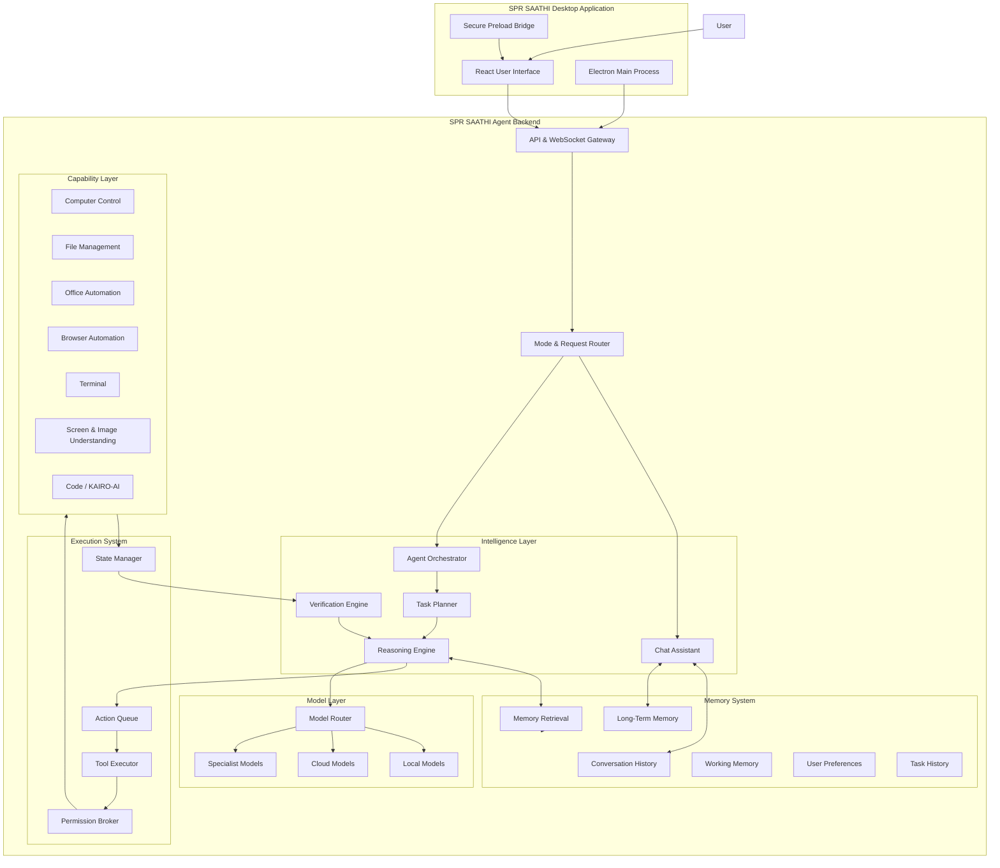
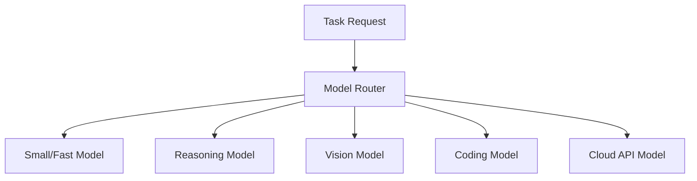
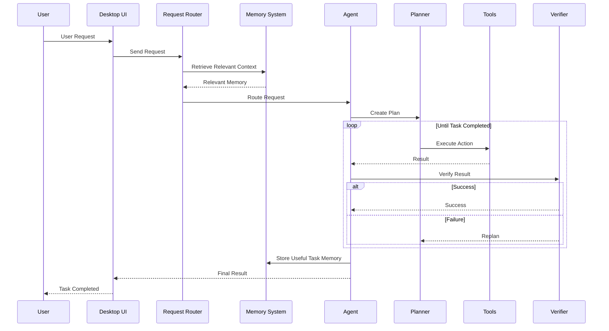

---
# Development Constitution / Mandatory Instructions
# SPR SAATHI — Complete System Architecture

## Vision

SPR SAATHI is not designed to be just a chatbot or a simple automation tool.

It is a **Windows AI Computer Agent** capable of understanding natural-language requests, reasoning about goals, interacting with the computer, using applications, managing files, processing user-provided data, collaborating with specialized AI systems, and learning from previous interactions.

The core principle is:

> **The user describes the desired outcome. SPR SAATHI determines how to achieve it.**

Examples:

* "Create an Excel report from this data."
* "Find the presentation I worked on last week and update the sales figures."
* "Open this image and recreate it in Paint."
* "Organize my Downloads folder."
* "Research this topic and prepare a report."
* "Modify these documents according to these instructions."
* "Build a website based on these requirements."
* "Ask KAIRO-AI to help me fix this code."
* "Remember that I prefer Excel reports with charts."

SPR SAATHI should operate as a general-purpose intelligent computer assistant rather than being designed around a fixed collection of demos or applications.

---

# 1. High-Level System Architecture



---

# 2. Dual Operating Mode System

SPR SAATHI will have two major operating modes.

## Mode 1: Chatbot Mode

This works similarly to ChatGPT.

The user can:

* Ask questions
* Have normal conversations
* Upload files
* Analyze documents
* Generate content
* Ask for explanations
* Discuss ideas
* Request research
* Use memory and conversation history

Example:

> "Explain quantum computing simply."

The system primarily behaves as an AI assistant.

---

## Mode 2: SPR SAATHI Agent Mode

This activates the autonomous computer agent.

Example:

> "Create an Excel file from this data and save it on my Desktop."

The system should:

1. Understand the final goal.
2. Inspect available resources.
3. Create a plan.
4. Decide which applications or tools are required.
5. Execute actions.
6. Observe the results.
7. Detect failures.
8. Recover if possible.
9. Verify the final outcome.
10. Report completion.

The user should not need to provide mouse coordinates, application names, or step-by-step instructions unless necessary.

---

# 3. Request Router

Every user message first enters the **Request Router**.

```text
User Message
      ↓
Intent Analysis
      ↓
┌─────────────────────────┐
│ What does the user want?│
└────────────┬────────────┘
             │
      ┌──────┼───────┐
      ↓      ↓       ↓
    Chat   Agent   Hybrid
```

### Chat Request

Example:

> "What is artificial intelligence?"

Route:

```text
User
 → Chat Agent
 → Model
 → Response
```

### Agent Request

Example:

> "Rename all PDF files in this folder."

Route:

```text
User
 → Agent Orchestrator
 → Plan
 → Execute
 → Verify
 → Complete
```

### Hybrid Request

Example:

> "Research electric vehicles, prepare a report, and save it as a Word document."

Route:

```text
Research
    ↓
AI Reasoning
    ↓
Generate Content
    ↓
Create Document
    ↓
Save File
    ↓
Verify
```

---

# 4. Agent Intelligence Architecture

The agent should use a continuous execution loop:

```text
UNDERSTAND
    ↓
OBSERVE
    ↓
RETRIEVE CONTEXT & MEMORY
    ↓
PLAN
    ↓
SELECT TOOLS
    ↓
CHECK PERMISSIONS
    ↓
EXECUTE
    ↓
VERIFY
    ↓
SUCCESS? ─── YES → COMPLETE
    │
    NO
    ↓
ANALYZE FAILURE
    ↓
REPLAN
```

This is critical.

SPR SAATHI must never assume:

> "The action was executed successfully, therefore the task is complete."

Instead:

> "The action executed. Now verify whether the desired result actually exists."

---

# 5. Memory Architecture

This will be one of the most important additions.

SPR SAATHI should not treat every conversation as completely new.

The memory system should consist of multiple layers.

---

## 5.1 Conversation Memory

Stores messages from the current conversation.

```text
Conversation
│
├── User Message
├── Assistant Response
├── Uploaded Files
├── Agent Actions
├── Task Results
└── Important Context
```

Example:

```text
User: My company is Shriram Pistons & Rings.
User: Create a report about our competitors.
User: Now convert it into a presentation.
```

SPR SAATHI should understand what "it" refers to.

---

## 5.2 Working Memory

Temporary memory for the currently active task.

Example:

```text
Task:
Create an Excel sales report.

Working Memory:

- Source file located.
- Excel opened.
- Sheet 1 contains raw sales data.
- Required columns identified.
- Chart created.
- File not yet saved.
```

This memory exists during execution and helps prevent the agent from losing track of the task.

---

## 5.3 Long-Term Memory

Persistent information across conversations.

Example:

```text
User preferences:

- Prefers English responses.
- Often works with Excel files.
- Uses Shriram Pistons & Rings documents.
- Prefers dark UI.
- Uses local AI models when possible.
```

However, memory should be stored selectively.

Not every conversation needs permanent memory.

---

## 5.4 User Preference Memory

Explicitly stores useful preferences.

Examples:

```text
Preferred language: English
Preferred report style: Professional
Default save location: Desktop/SPR SAATHI
Preferred spreadsheet format: XLSX
Preferred coding assistant: KAIRO-AI
```

The user should be able to:

* View memories
* Edit memories
* Delete individual memories
* Disable memory
* Clear all memory

---

## 5.5 Task Memory

SPR SAATHI should remember previous tasks.

Example:

```text
Task:
Create quarterly sales report.

Status:
Completed.

Created Files:
- Q1_Sales_Report.xlsx

Applications Used:
- Microsoft Excel

Important Results:
- Sales chart created
- Data cleaned
```

This enables requests such as:

> "Open the report you created yesterday."

---

## 5.6 Semantic Memory Retrieval

The system should not send the entire conversation history to the model every time.

Instead:

```text
Current User Request
        ↓
Memory Retrieval
        ↓
Find Relevant Information
        ↓
Inject Only Relevant Context
        ↓
Model Reasoning
```

Example:

User says:

> "Use the same format as last time."

The retrieval system searches past tasks and retrieves the relevant report structure.

---

# 6. Model Intelligence Layer

SPR SAATHI should support multiple models.



The model should be selected based on the task.

### Examples

| Task                 | Model Type              |
| -------------------- | ----------------------- |
| Simple conversation  | Fast general model      |
| Complex planning     | Reasoning model         |
| Screen understanding | Vision model            |
| Coding               | KAIRO-AI / Coding model |
| Image analysis       | Vision model            |
| Complex research     | Cloud reasoning model   |

The architecture should avoid forcing one model to do everything.

---

# 7. Tool and Capability Architecture

Tools should be organized by capability rather than by specific applications.

```text
Capabilities
│
├── Computer Control
│   ├── Mouse
│   ├── Keyboard
│   ├── Windows
│   └── Screens
│
├── File Operations
│   ├── Search
│   ├── Read
│   ├── Move
│   ├── Rename
│   ├── Delete
│   └── Organize
│
├── Office Automation
│   ├── Excel
│   ├── Word
│   ├── PowerPoint
│   └── PDF
│
├── Browser
│   ├── Navigate
│   ├── Search
│   ├── Extract Information
│   └── Interact
│
├── Vision
│   ├── Screen Understanding
│   ├── Object Detection
│   ├── UI Understanding
│   └── Image Analysis
│
├── Coding
│   ├── KAIRO-AI
│   ├── Code Analysis
│   ├── Project Editing
│   └── Testing
│
└── System
    ├── Terminal
    ├── Processes
    └── Applications
```

The agent should choose tools dynamically.

---

# 8. Screen and Vision System

The agent needs a proper perception layer.

```text
Screen Capture
      ↓
Vision Model
      ↓
UI Understanding
      ↓
Structured Observation
```

Example output:

```json
{
  "active_window": "Microsoft Excel",
  "visible_elements": [
    {
      "type": "button",
      "label": "Save"
    },
    {
      "type": "spreadsheet",
      "cells_visible": true
    }
  ]
}
```

The agent should gradually move away from blindly relying on hardcoded coordinates.

---

# 9. Action Execution System

All computer actions should pass through a central execution system.

```text
Agent Decision
      ↓
Action ID Created
      ↓
Action Queue
      ↓
Permission Check
      ↓
Execute
      ↓
Observe Result
      ↓
Verify
```

Important features:

* Stable Action IDs
* Idempotency protection
* Input serialization
* Retry management
* Cancellation
* Timeout handling
* Execution history
* Failure recovery

This prevents duplicate or overlapping execution.

---

# 10. Specialized Office and File Intelligence

SPR SAATHI should support structured workflows.

## Excel

```text
User uploads CSV
       ↓
Analyze Data
       ↓
Determine Required Workbook Structure
       ↓
Create Excel File
       ↓
Format Tables
       ↓
Generate Charts
       ↓
Save
       ↓
Verify File
```

## Documents

```text
Locate File
    ↓
Read Document
    ↓
Understand Requested Changes
    ↓
Modify Relevant Sections
    ↓
Save New Version
    ↓
Verify
```

The agent should use structured APIs where possible instead of physically clicking through every interface.

---

# 11. KAIRO-AI Integration

SPR SAATHI should integrate with KAIRO-AI as a specialized coding capability.

```text
User Coding Request
        ↓
SPR SAATHI
        ↓
Is this a coding task?
        ↓
       YES
        ↓
KAIRO-AI
        ↓
Code Analysis / Changes
        ↓
Testing
        ↓
Results Returned
        ↓
SPR SAATHI
        ↓
User
```

SPR SAATHI acts as the overall orchestrator.

KAIRO-AI acts as a specialized coding intelligence.

---

# 12. File Intelligence System

SPR SAATHI should understand the user's file environment.

```text
File Request
     ↓
File Search Engine
     ↓
Candidate Files
     ↓
AI Relevance Ranking
     ↓
Select Correct File
     ↓
Perform Requested Operation
```

Example:

> "Find the presentation about electric vehicles and change the conclusion."

The user should not necessarily need to provide the exact path.

---

# 13. Safety and Permission System

Permissions should operate at multiple levels.

```text
Action
  ↓
Risk Classification
  ↓
Permission Policy
  ↓
┌───────────────┐
│ Allow         │
│ Ask User      │
│ Deny          │
└───────────────┘
```

High-risk actions include:

* Deleting files
* Sending emails
* Making purchases
* Executing dangerous terminal commands
* Uploading private files
* Modifying critical system settings

The user should retain control.

---

# 14. State Management

The system must maintain a structured representation of every active task.

```text
Task State
│
├── Task ID
├── User Goal
├── Current Plan
├── Current Step
├── Completed Steps
├── Failed Steps
├── Available Resources
├── Active Application
├── Relevant Files
├── Memory Context
├── Action History
└── Verification Status
```

This prevents the agent from losing context during long tasks.

---

# 15. Communication Architecture

```text
React UI
    ↕
Electron IPC
    ↕
Electron Main Process
    ↕
FastAPI Backend
    ↕
WebSocket Event Stream
    ↕
Agent Runtime
```

### REST

Used for:

* Starting tasks
* Stopping tasks
* Configuration
* Permissions
* Memory management

### WebSockets

Used for:

* Live thinking status
* Plans
* Actions
* Observations
* Errors
* Permission prompts
* Task progress

---

# 16. Data Storage Architecture

A suggested structure:

```text
SPR SAATHI Data
│
├── conversations/
│   ├── conversation_metadata
│   └── messages
│
├── memories/
│   ├── user_preferences
│   ├── long_term_memories
│   └── embeddings
│
├── tasks/
│   ├── active_tasks
│   └── task_history
│
├── execution/
│   ├── action_history
│   ├── traces
│   └── errors
│
└── files/
    └── managed_workspace
```

A practical implementation could use:

* **SQLite/PostgreSQL** for structured data
* **Vector database** for semantic memory retrieval
* **Filesystem/object storage** for large artifacts

---

# 17. Complete Task Execution Flow

The complete future architecture should work like this:



---

# Final Architectural Principle

The future SPR SAATHI architecture should be based on five core systems:

### 1. Intelligence

Understanding, reasoning, planning and decision-making.

### 2. Memory

Remembering conversations, preferences, tasks and relevant context.

### 3. Perception

Understanding screens, files, applications and user-provided information.

### 4. Action

Using tools to interact with Windows and external systems.

### 5. Verification

Checking whether actions actually produced the intended result.

---

## The ultimate flow

```text
USER GOAL
    ↓
UNDERSTAND
    ↓
REMEMBER
    ↓
PLAN
    ↓
ACT
    ↓
OBSERVE
    ↓
VERIFY
    ↓
LEARN
    ↓
COMPLETE
```

                         USER
                           │
                    SPR SAATHI UI
                           │
                  Request / Mode Router
                           │
          ┌────────────────┴────────────────┐
          │                                 │
      CHAT SYSTEM                      AGENT SYSTEM
          │                                 │
          └───────────────┬─────────────────┘
                          │
                   CONTEXT BUILDER
                          │
        ┌─────────────────┼──────────────────┐
        │                 │                  │
      MEMORY          KNOWLEDGE          PERCEPTION
        │                 │                  │
        └─────────────────┼──────────────────┘
                          │
                  AGENT ORCHESTRATOR
                          │
        ┌─────────────────┼──────────────────┐
        │                 │                  │
      PLANNER          REASONER       SKILL SELECTOR
                          │
                     MODEL ROUTER
                          │
               SPECIALIST AI SYSTEMS
                          │
                    ACTION QUEUE
                          │
                  PERMISSION SYSTEM
                          │
                   TOOL EXECUTION
                          │
                     ENVIRONMENT
                          │
                    VERIFICATION
                          │
                FAILURE / RECOVERY ENGINE
                          │
                       RESULT

                       Below is the **exact architectural section I recommend adding to your `architecture.md`**. You can integrate it into the existing document as a new section, rather than replacing the entire architecture.

---

# Future Architecture Extensions Required for the SPR SAATHI Vision

The current architecture provides the foundation for an autonomous Windows AI agent. However, SPR SAATHI is intended to evolve beyond a basic desktop automation agent.

The long-term vision is to create an intelligent AI system capable of understanding high-level user goals and independently completing a wide variety of tasks, including:

* Answering questions and having natural conversations.
* Operating Windows applications.
* Creating and modifying documents.
* Working with Excel, Word, PowerPoint, and other office files.
* Understanding and modifying user-provided files.
* Creating and editing images.
* Browsing and researching information.
* Managing files and folders.
* Performing coding tasks through integration with KAIRO-AI.
* Learning useful user preferences through an explicit memory system.
* Recovering intelligently when an action fails.
* Selecting the most appropriate AI model, tool, or specialist for each task.

To support this vision, the following architectural components should be included.

---

## 1. Skills and Capability Layer

SPR SAATHI should not solve every task by directly generating low-level mouse and keyboard actions.

A distinction must exist between **tools** and **skills**.

### Tools

Tools are low-level capabilities such as:

* `mouse_click`
* `mouse_drag`
* `keyboard_type`
* `keyboard_press`
* `launch_application`
* `read_file`
* `write_file`

### Skills

Skills are reusable high-level workflows built using one or more tools.

Examples include:

* Create an Excel report.
* Edit a Word document.
* Generate a PowerPoint presentation.
* Research a topic.
* Analyze a dataset.
* Modify an image.
* Organize files.
* Create a software project.
* Debug code.
* Generate a report from multiple documents.

The architecture should therefore include:

```text
User Goal
    ↓
Agent Orchestrator
    ↓
Skill Selection
    ↓
Skill Workflow
    ↓
Tools and Services
    ↓
Execution and Verification
```

This prevents the agent from relying exclusively on raw computer interaction for complex and repeatable tasks.

---

# 2. Context Builder

The AI model should not receive every available piece of information for every request.

SPR SAATHI should contain a dedicated **Context Builder** responsible for collecting and selecting only the information relevant to the current task.

Potential context sources include:

```text
Context Sources
│
├── Current Conversation
├── Conversation History
├── User Memory
├── Task History
├── Uploaded Files
├── Generated Files
├── Current Screen
├── Active Application
├── Operating System State
├── Browser Context
├── Internet Research
└── Specialist Agent Results
```

The Context Builder should produce a structured and task-specific context package before sending information to the selected model.

```text
Available Information
        ↓
Context Builder
        ↓
Relevance Filtering
        ↓
Structured Context Package
        ↓
AI Model / Agent
```

This will reduce unnecessary context usage and improve reasoning quality.

---

# 3. Workspace and Artifact Manager

SPR SAATHI will frequently work with files created or provided by the user.

A dedicated **Workspace Manager** should therefore manage the complete lifecycle of files and generated artifacts.

The system should distinguish between:

```text
Workspace
│
├── User Uploads
├── Source Files
├── Temporary Files
├── Generated Files
├── Modified Files
├── Intermediate Artifacts
├── Previous Versions
└── Final Deliverables
```

The Artifact Manager should track:

* Where a file originated.
* Which task created or modified it.
* Which source files were used.
* Previous versions.
* The current version.
* The final output location.

This will allow the user to make requests such as:

> "Open the report you created yesterday and update the sales figures."

without requiring the user to manually locate the previous file.

---

# 4. Dedicated Task Manager

Task state should not be managed only as part of the agent loop.

SPR SAATHI should contain a dedicated **Task Manager** responsible for managing the lifecycle of every task.

Each task should have a unique identity and maintain:

* Task ID.
* User request.
* Current status.
* Execution plan.
* Active step.
* Completed steps.
* Generated artifacts.
* Errors.
* Recovery attempts.
* User intervention history.

Possible task states:

```text
Created
   ↓
Planning
   ↓
Waiting for Permission
   ↓
Executing
   ↓
Verifying
   ↓
Completed
```

Alternative states:

```text
Paused
Waiting for User
Recovering
Failed
Cancelled
```

This architecture will support long-running tasks and reliable pause, resume, cancellation, and recovery.

---

# 5. Unified Perception Layer

Screen screenshots alone should not be the primary source of environmental understanding.

SPR SAATHI should use the most reliable source of information available.

The Perception Layer should combine:

```text
Perception Layer
│
├── Screen Capture
├── Vision Models
├── Active Window Information
├── Window Titles
├── Running Processes
├── Application Accessibility APIs
├── Browser DOM
├── File System State
├── Clipboard State
├── Structured Document Data
└── Application-Specific APIs
```

The preferred strategy should be:

```text
Structured Application Data
        ↓
Accessibility / API Information
        ↓
DOM or Application Metadata
        ↓
Vision-Based Understanding
        ↓
Raw Screen Interaction
```

Vision should be used when structured information is unavailable, rather than unnecessarily using screenshots for tasks that can be solved more reliably through APIs or application data.

---

# 6. Multi-Level Verification System

A successfully executed tool action must not automatically be considered a successful task.

SPR SAATHI should verify actions at multiple levels.

```text
Verification System
│
├── Tool-Level Verification
├── Application-Level Verification
├── File-Level Verification
├── Visual Verification
├── Data Verification
└── Goal-Level Verification
```

For example:

```text
Agent performs mouse drag
        ↓
Tool reports success
        ↓
This only confirms the input was sent
        ↓
Capture application state
        ↓
Verify expected visual or data change
        ↓
Determine whether the actual goal was achieved
```

This is especially important for graphical applications such as Paint.

A task should only be marked as completed when the required outcome has been verified.

---

# 7. Failure Classification and Recovery Engine

The system should contain a dedicated **Failure Recovery Engine**.

When an operation fails, the agent should first determine the type of failure rather than blindly repeating the same action.

Failure categories may include:

```text
Failure
│
├── Tool Failure
├── Application Failure
├── Model Failure
├── Permission Failure
├── File Failure
├── Network Failure
├── Verification Failure
├── Timeout
└── Unknown Failure
```

The system should then select an appropriate recovery strategy.

Example:

```text
Application Launch Failed
        ↓
Check Existing Process
        ↓
Check Existing Window
        ↓
Wait for Startup
        ↓
Try Alternative Launch Method
        ↓
Verify Again
        ↓
Ask User for Help if Necessary
```

Recovery attempts should be limited and tracked to prevent infinite loops.

---

# 8. Explicit Memory Management System

Conversation history and long-term memory should be treated as separate systems.

SPR SAATHI should include a dedicated **Memory Manager**.

```text
Memory Manager
│
├── Conversation History
├── Short-Term Context
├── Task Memory
├── Long-Term User Memory
├── Preference Memory
└── Project Memory
```

The Memory Manager should be responsible for:

* Extracting useful memories.
* Determining memory importance.
* Avoiding unnecessary storage.
* Resolving conflicting information.
* Retrieving relevant memories.
* Allowing users to view memories.
* Allowing users to modify memories.
* Allowing users to delete memories.

The core principle should be:

> Conversation history is not automatically long-term memory.

Only useful and durable information should become persistent memory.

---

# 9. Human Intervention and Clarification System

The current permission system handles whether the agent is allowed to perform an action.

However, SPR SAATHI should also be able to request clarification when it cannot confidently determine what the user wants.

Examples include:

* Multiple files match the user's description.
* A required value is missing.
* Multiple possible actions could satisfy the request.
* The task contains an ambiguous instruction.

The architecture should support:

```text
Agent detects uncertainty
        ↓
Task enters Waiting for User state
        ↓
User receives clarification request
        ↓
User responds
        ↓
Task resumes from its previous state
```

This should be separate from permission requests.

---

# 10. Model Routing and AI Provider Layer

The Model Router should dynamically select models based on more than the task category.

Model selection should consider:

```text
Model Selection Factors
│
├── Task Complexity
├── Required Reasoning Ability
├── Vision Requirements
├── Context Size
├── Latency Requirements
├── Privacy Requirements
├── Local Hardware Resources
├── Model Availability
└── Cost
```

Example:

```text
Simple conversation
→ Fast local model

Sensitive company document
→ Local/private model

Complex reasoning
→ High-capability reasoning model

Image understanding
→ Vision model

Coding task
→ KAIRO-AI
```

The Model Router should also support fallback strategies when a preferred model is unavailable.

---

# 11. Specialist Agent and Service Delegation Layer

SPR SAATHI should act as the primary orchestrator rather than requiring one model to perform every type of task.

The architecture should support specialist systems.

```text
SPR SAATHI Orchestrator
│
├── General Chat Agent
├── Computer Interaction Agent
├── Research Agent
├── Document Agent
├── Data Analysis Agent
├── Vision Agent
├── Coding Agent
│      └── KAIRO-AI Integration
└── Future Specialist Systems
```

The orchestrator should decide whether a task should be solved directly or delegated to a specialist.

This architecture should be extensible so that additional specialists can be introduced without redesigning the entire system.

---

# 12. Observability and Debugging Layer

Because SPR SAATHI is an autonomous system, debugging must be built into the architecture.

A dedicated observability system should track:

```text
Observability
│
├── Task Timeline
├── Agent Decisions
├── Model Requests
├── Tool Calls
├── Action Results
├── Permission Events
├── Screenshots and Observations
├── Verification Results
├── Recovery Attempts
├── Errors
└── Performance Metrics
```

Each significant event should be associated with a Task ID and, where appropriate, an Action ID.

This will make it possible to trace the complete execution path of a task.

---

# 13. Action Identity and Execution Coordination

Every action generated by the agent should have a unique Action ID.

The execution architecture should prevent accidental duplicate execution caused by:

* Retries.
* WebSocket reconnections.
* Event replay.
* Async race conditions.
* Duplicate task processing.

The system should use execution identity rather than comparing action text.

Two legitimate actions with identical parameters must still be allowed to execute if they have different Action IDs.

The system should also coordinate access to shared system resources such as:

* Keyboard input.
* Mouse input.
* Clipboard.
* Foreground application focus.

This prevents multiple concurrent actions from interfering with one another.

---

# 14. Recommended Updated High-Level System Architecture

The future architecture of SPR SAATHI should follow the structure below:

```text
                              USER
                                │
                                ▼
                        SPR SAATHI DESKTOP UI
                                │
                                ▼
                       REQUEST AND MODE ROUTER
                         │                 │
                         │                 │
                         ▼                 ▼
                    CHAT SYSTEM        AGENT SYSTEM
                         │                 │
                         └────────┬────────┘
                                  │
                                  ▼
                            CONTEXT BUILDER
                                  │
             ┌────────────────────┼────────────────────┐
             │                    │                    │
             ▼                    ▼                    ▼
           MEMORY             KNOWLEDGE            PERCEPTION
             │                    │                    │
             └────────────────────┼────────────────────┘
                                  │
                                  ▼
                         AGENT ORCHESTRATOR
                                  │
            ┌─────────────────────┼─────────────────────┐
            │                     │                     │
            ▼                     ▼                     ▼
       TASK MANAGER          SKILL SYSTEM        MODEL ROUTER
            │                     │                     │
            └─────────────────────┼─────────────────────┘
                                  │
                                  ▼
                     SPECIALIST AGENTS / SERVICES
                                  │
                                  ▼
                           ACTION PLANNER
                                  │
                                  ▼
                       EXECUTION COORDINATOR
                                  │
                                  ▼
                         PERMISSION SYSTEM
                                  │
                                  ▼
                             TOOL LAYER
                                  │
                                  ▼
                              WINDOWS
                                  │
                                  ▼
                           VERIFICATION
                                  │
                                  ▼
                    FAILURE RECOVERY ENGINE
                                  │
                     ┌────────────┴────────────┐
                     │                         │
                     ▼                         ▼
                 CONTINUE                  FINAL RESULT
```

---

# Final Architectural Principles

The architecture should follow these principles:

1. **The user provides goals, not low-level instructions.**
2. **SPR SAATHI decides how to accomplish the goal.**
3. **Tools provide atomic capabilities.**
4. **Skills provide reusable high-level workflows.**
5. **The system should prefer structured APIs over screen automation whenever possible.**
6. **A successful tool call does not automatically mean a successful task.**
7. **Every important result must be verified.**
8. **Failures must be classified before recovery is attempted.**
9. **Conversation history and persistent memory must remain separate.**
10. **Users must retain control over permissions, memory, and sensitive operations.**
11. **The architecture must support local and cloud AI models.**
12. **Specialist AI systems should be integrated through delegation rather than tightly coupled implementations.**
13. **The system should remain extensible as new tools, models, and capabilities are introduced.**
14. **Every major decision and action should be traceable for debugging and reliability.**

---
